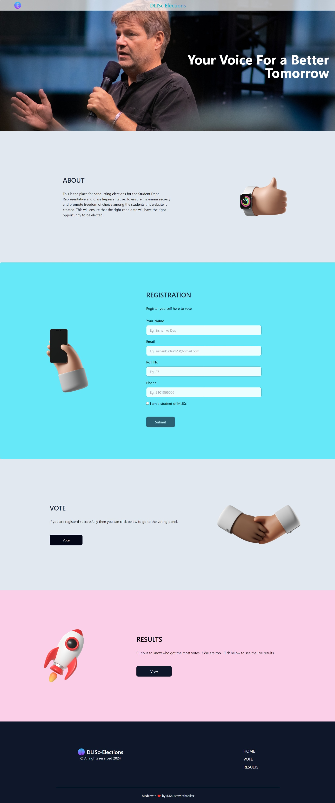
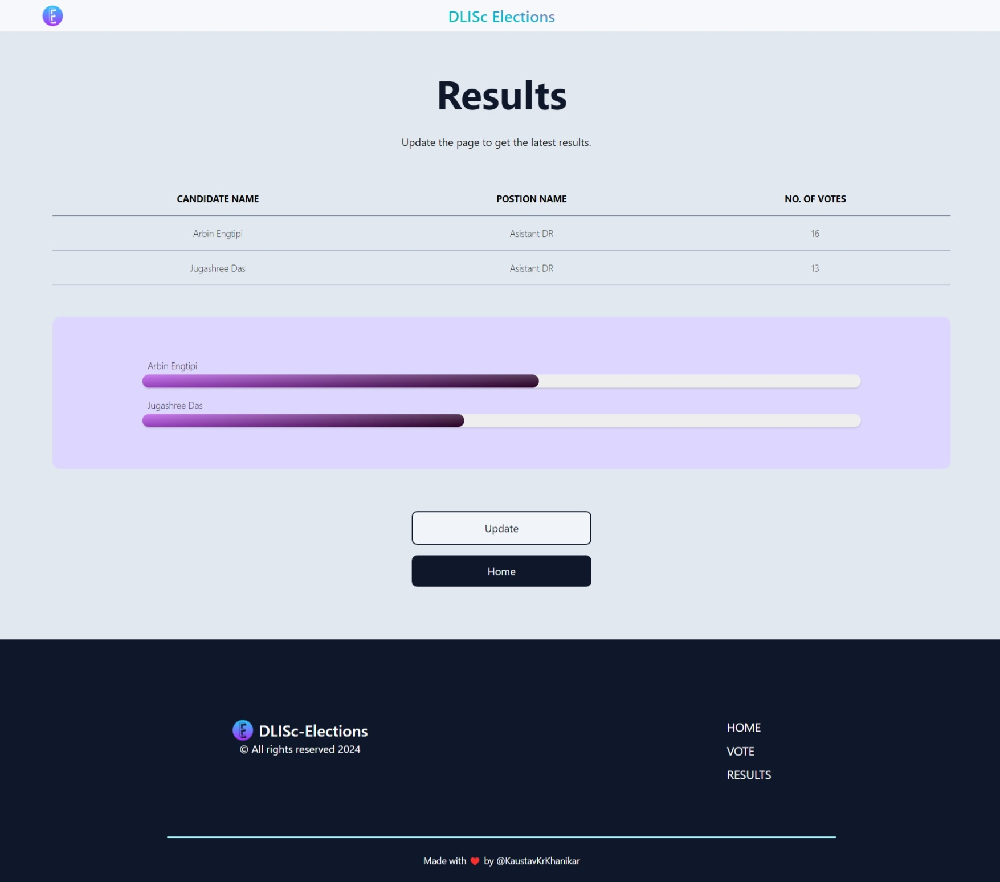
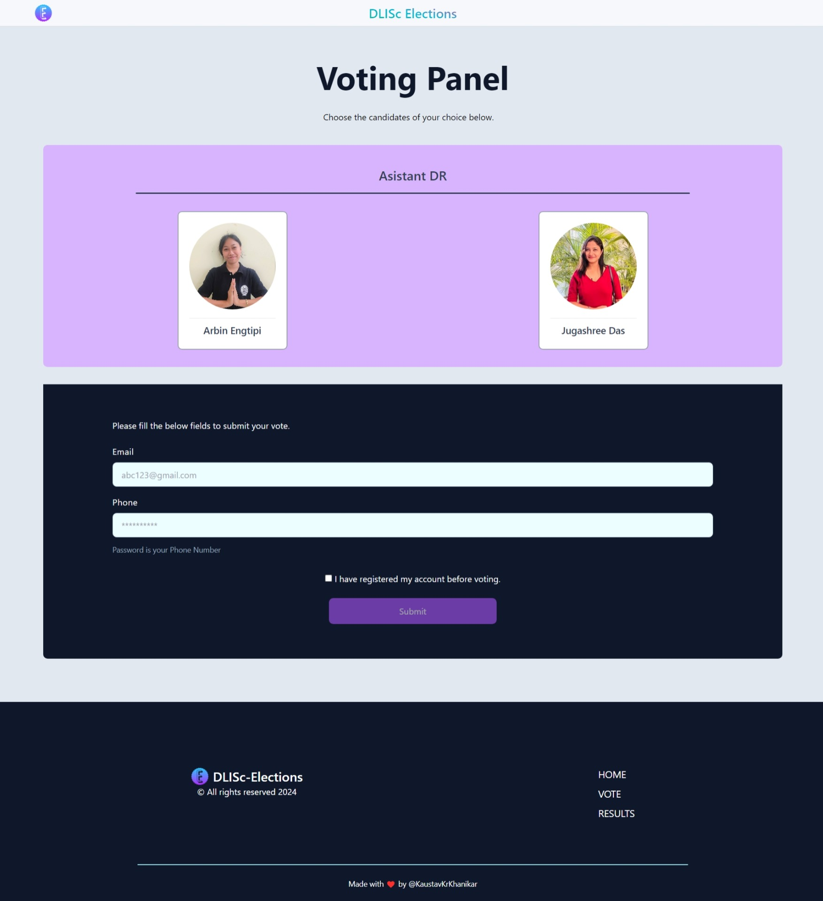

<div style="align:center">
 
</div>
<h1> DLISc Elections </h1>

 <h4>This is the DLISc Elections website for student representative elections.</h4>
 

______________________________________________________________________________________
# Software Used
<div>
 
</div>

The project is build with Django. The Database is the ~Sqlite3 which comes in built with the Django Framework,since the amount of data we are dealing with is very small so no external database is implemented.  

It also uses HTMX.

Tailwind CSS is used for the styles.


________________________________________________________________________________________
# Usage

#### To get it up and running quickly:
Make sure you have python@latest on your machine.


### The easier method :


> Download the zip file by selecting the branch as master.


> Unzip it and move inside the DLISc_Elections folder.


> You have to activate the environment by typing the below command.

```javascript
$.\env\Scripts\activate
```


> If the environment is activated successfully, you will see something like ```$(env)``` in the terminal. Now move inside the main folder.


```javascript
$ python3 manage.py runserver
```
This will start the server on 8000
> Vist the below link in browser 
```javascript 
$ http://127.0.0.1:8000
 ```

And you are good to go.


### or (other method)
> Copy the Below command if you have git bash installed on your computer.
```javascript
$ git clone https://github.com/Hungryfoxz/DLISc_Elections.git
```
This will create a folder named DLISc_Elections into your current working directory.
> Now cd into the directory 
```javascript
$ cd DLISc_Elections
```
Now you will see a directory tree something like this.

```bash
|--env
|--main
|    |--app
|    |--jstoochain
|    |--main
|    |--static
|    |    |--assets
|    |    |--css
|    |    |--logo
|    |    |--profiles
|    |--templates
|    |    |--admin
|    |    |--components
|    |    |--base.html
|    |    |--index.html
|    |    |--result.html
|    |    |--vote.html
|    |--db.sqlite3
|    |--input.css
|    |--manage.py
|--screenshots
|--readme
|--requirements.txt

```


> You have to activate the environment by typing the below command.

```javascript
$.\env\Scripts\activate
```

> If the environment is activated successfully, you will see something like ```$(env)``` in the terminal. Now move inside the main folder. 

```javascript
$ cd main
```

Now once you are inside the second main directory just type in the bellow command to start the development server.
> By default it will run on http://127.0.0.1:8000
```javascript
$ py manage.py runserver
```


### Default Credentials

Login to the admin panel with this url : 
### http://127.0.0.1:8000/admin


```username :```
> ##### hungry


```password :```
> ##### hungry


After you have successfully logged in , Go to the users table and add New user and select the previledges. Add new admin and password as your choice and give him the 'super-user' access and after the new 'super-user' is created remove the default superuser.


# Working :

#### ```Home/Index page```


> On successfull Completion of the Server setup , You will be greeted with this page.


```Home Page```
<div style="align:center">
 
</div>

>
 ```Results Page```
<div style="align:center">
 </img>
</div>

>
 ```Vote Page```
<div style="align:center">
 </img>
</div>

> Mobile View.


- [`MOBILE Home Page`](./screenshots/mobile_home.jpeg)
- [`MOBILE Results Page`](./screenshots/mob_res.jpeg)
- [`MOBILE Vote Page`](./screenshots/mob_vot.jpeg)


### ``` Database area```
> The Database to control all the Tables for inserting data.

>```Candidate List``` --- Name and Bio of the candidates.<br/>
>```Registration``` --- Students who have registerd for the elction process.<br/>
>```Voted Student List``` --- Students who have casted their votes.<br/>
>```Voter Positions List``` --- The position list that the various candidates are representing for.<br/>

> In addition it contains two buttons.

```Voting ON/OFF```<br/>
```Results Show/Hide```


_________________________________________________________________________________________
## Comments
>
 Building this website was a rewarding journey from concept to code. Django's built-in SQLite3 database significantly simplified the development process, making it the preferred choice.<br/>

 This project was completed within 16 hours in one day. With this project I learned HTMX, and I have to admit HTMX is feels so powerful.
 It significantly decreases the amount of javascript to be written and is so much better to work on. Although many developers might have different opinions about it, as a beginner I liked it very much.<br/>

 I am well acquinted with the process of developing logic for voting website as I have done it a few times before. Hence it was 
 less time consuming for me.<br/>

 Although I have made websites before but I haven't used them in real life. Thanks to Ngrok ,which helped me to host the website from my laptop and tunneling though ngrok servers to the users. Without Ngrok this would not have been possible.<br/>

 ```Fun Fact``` The idea of building the website came as a fun project when I was discussing about the upcoming Department Representative with my friend Chintan Sharma. I thought why not develop a website for 2024 DR and ADR elections of DLISc, Gauhati University...<br/>


## Acknowledgments
 Although many difficulties were faced during the project, they were tackled smoothly thanks to the open source community and stackoverflow. Also Django provides some excellent documentation.

## See Also

- [`Django Documentation`](https://github.com/noffle/common-readme)
- [`StackOverflow`](https://stackoverflow.com)
- [`Tailwind`](https://tailwindcss.com)
- [`HTMX`](https://htmx.org)

## License

Not Licenced.